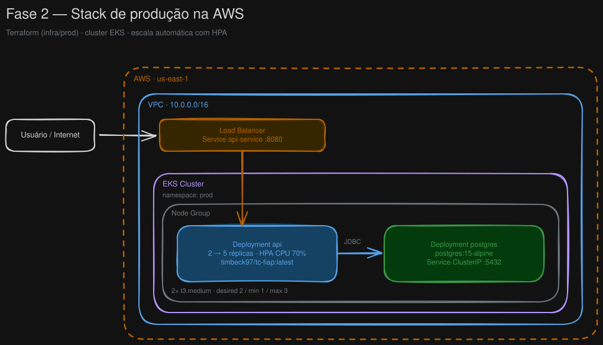

# Oficina Mecânica - Gestão de Serviços

MVP do back-end de um Sistema Integrado de Atendimento e Execução de Serviços para uma oficina
mecânica de médio porte. O sistema digitaliza o processo de atendimento, diagnóstico, orçamento,
execução e entrega de veículos, substituindo anotações manuais e planilhas — eliminando erros de
priorização, falhas no controle de peças e perda de histórico de clientes e veículos.

O projeto é um **monolito** desenvolvido com **Domain-Driven Design (DDD)**, expondo **APIs REST**
documentadas via **Swagger** e protegidas por **autenticação JWT**.

## Documentação no MIRO

[Documentação DDD](https://miro.com/app/board/uXjVHIl34Zc=/?share_link_id=851279149523)

## Funcionalidades implementadas (MVP)

**Cadastros e catálogo**
- Cadastro de cliente com identificação por CPF/CNPJ (validação de dados sensíveis com dígitos verificadores)
- Cadastro de veículo (placa no padrão Mercosul, marca, modelo, ano, km)
- CRUD completo de **serviços** (catálogo)
- CRUD completo de **peças/insumos** com **controle de estoque** (entrada/saída)

**Ordem de Serviço (OS)**
- Abertura da OS vinculando cliente e veículo
- Orçamento da OS com peças e serviços e **cálculo automático do total**
- Aprovação/rejeição do orçamento pelo cliente
- Descrição do diagnóstico registrada ao encerrar o diagnóstico
- Conclusão da execução por item de serviço (data de fim por serviço); a OS só é finalizada quando todos os serviços estão concluídos
- **Monitoramento do tempo médio de execução por tipo de serviço**
- Fila de atendimento por prioridade (aumentar/diminuir prioridade)
- Listagem e detalhamento de OS (por id, por cliente e por status)

**Acompanhamento (fluxo de status)**

A OS percorre os estados abaixo, com transição automática conforme as ações no sistema:

```
RECEBIDA ──► EM_DIAGNÓSTICO ──► AGUARDANDO_APROVAÇÃO ──► EM_EXECUÇÃO ──► FINALIZADA ──► ENTREGUE
(RECEIVED)   (IN_DIAGNOSIS)     (AWAITING_APPROVAL)       (IN_EXECUTION)   (FINALIZED)    (DELIVERED)
                                         │
                                    rejeitar
                                         ▼
                                    CANCELADA
                                    (CANCELED)
```

A recusa do orçamento encerra a OS em CANCELED — estado final, nenhuma transição sai dele. O próprio
cliente (role `CUSTOMER`) pode recusar o orçamento da sua OS; a oficina (`USER`/`ADMIN`) também pode
registrar a recusa.

**Caminho curto (3 chamadas até a aprovação):** o orçamento é criado sob demanda no primeiro item
adicionado e é finalizado junto com o diagnóstico, então não existem endpoints separados para
"abrir" e "fechar" orçamento:

```
POST  /service-orders                            → RECEIVED
PATCH /service-orders/{id}/start-diagnosis       → IN_DIAGNOSIS
PATCH /service-orders/{id}/finalize-diagnosis    → AWAITING_APPROVAL   (aceita os itens do orçamento no corpo)
PATCH /service-orders/{id}/execute               → IN_EXECUTION        (cliente aprovou)
PATCH /service-orders/{id}/budget/items/{itemId}/complete   (um por serviço executado)
PATCH /service-orders/{id}/finalize              → FINALIZED
PATCH /service-orders/{id}/deliver               → DELIVERED
```

Quem preferir montar o orçamento aos poucos continua podendo usar `POST .../budget/items`
(lote de peças e serviços), `POST .../budget/parts`, `POST .../budget/services` e
`PATCH .../budget/finalize` antes de encerrar o diagnóstico.
**Notificações**
- E-mail automático para o cliente a cada mudança de status da OS (uma mensagem por transição,
  do recebimento à entrega), disparado por evento de domínio após o commit da transação
- Envio assíncrono e *best-effort*: uma falha de SMTP registra erro no log e **nunca** afeta a
  operação de negócio nem a resposta da API
- SMTP configurável por variáveis de ambiente (MailHog no desenvolvimento; Gmail, SES ou
  Mailtrap em outros ambientes) — sem mudança de código

**Segurança e qualidade**
- Autenticação JWT (HS256) nas APIs administrativas
- Validação de dados sensíveis (CPF/CNPJ, placa de veículo)
- Validação de payload nas APIs (Bean Validation): campos obrigatórios e IDs ausentes respondem
  `400` com a lista de `fieldErrors`, em vez de estourar no repositório
- Tratamento global de exceções com respostas de erro padronizadas (`400` para payload/parâmetro
  inválido, `404`, `405`, `409` de conflito de estado)
- Testes unitários (domínio e casos de uso) e de integração (fluxo completo da OS)

> **Fora do escopo desta versão:** comunicação em tempo real com o cliente (chat/push).
> As notificações são feitas por e-mail, de forma assíncrona.

## Arquitetura

Monolito em camadas seguindo DDD, organizado por **módulos** (bounded contexts) em
`src/main/java/.../modules`:

| Módulo | Responsabilidade |
|---|---|
| `auth` | Registro/login de usuários e emissão/validação de JWT |
| `register` | Cadastro de clientes e veículos |
| `inventory` | Catálogo de peças e serviços + controle de estoque |
| `serviceorder` | Ordem de serviço, orçamento, diagnóstico e ciclo de vida |
| `notifications` | Envio de e-mail ao cliente a cada mudança de status da OS |
| `shared` | Exceções, handler global de erros e blocos de domínio comuns |

Cada módulo é dividido em `domain` (entidades, value objects, repositórios),
`application` (casos de uso, comandos, respostas), `infrastructure` (persistência JPA, mappers,
segurança) e `presentation` (controllers e DTOs).

## Tecnologias Utilizadas
- **Java 21** + **Spring Boot 3.2** (API REST, porta `8080`)
- **Spring Security** + **OAuth2 Resource Server** (JWT HS256)
- **Spring Data JPA** / **Hibernate 6**
- **PostgreSQL 15** (banco de dados relacional, porta `5432`)
- **H2** (em memória, apenas para os testes de integração)
- **Gradle** (build via wrapper `./gradlew`)
- **Docker** + **Docker Compose** (orquestração local)
- **springdoc-openapi** (Swagger UI)
- **SonarQube** (porta `9000`)

### Por que PostgreSQL?
O domínio é fortemente relacional — cliente → veículo → ordem de serviço → orçamento → itens —
e o ciclo de vida da OS exige **consistência transacional (ACID)** nas mudanças de status e na
montagem/finalização do orçamento. O PostgreSQL atende a esses requisitos com maturidade, é
open-source, tem suporte nativo a `UUID` (usado como identificador das entidades) e excelente
integração com Spring Data JPA, sendo a escolha natural para garantir integridade do histórico
de clientes, veículos e atendimentos.

## Pré-requisitos
- [Docker](https://docs.docker.com/get-docker/) e Docker Compose v2
- (Opcional, apenas para executar sem containers) JDK 21

## Configuração
A aplicação lê as credenciais do banco de dados e demais configurações a partir de variáveis de ambiente.
Um template está disponível em `.env.example` — **nunca commite o seu `.env` real** (ele já está no `.gitignore`).

```bash
cp .env.example .env      # Windows PowerShell: copy .env.example .env
```

Em seguida, edite o `.env` e defina um valor real para `DB_PASSWORD` (e `JWT_SECRET` para
ambientes fora do desenvolvimento).

| Variável | Padrão | Descrição |
|---|---|---|
| `DB_NAME` | `oficina_db` | Nome do banco de dados PostgreSQL |
| `DB_USER` | `oficina` | Usuário do PostgreSQL |
| `DB_PASSWORD` | — | Senha do PostgreSQL (defina a sua) |
| `DB_PORT` | `5432` | Porta do host mapeada para o PostgreSQL |
| `SPRING_PROFILE` | `dev` | Perfil ativo do Spring |
| `SPRING_JPA_HIBERNATE_DDL_AUTO` | `none` | Estratégia DDL do Hibernate |
| `JWT_SECRET` | padrão dev | Segredo de assinatura JWT (substitua fora do dev) |
| `JWT_EXPIRATION` | `3600` | Expiração do JWT em segundos |
| `MAIL_HOST` | `mailhog` | Host do servidor SMTP |
| `MAIL_PORT` | `1025` | Porta SMTP (mapeada do MailHog para o host) |
| `MAIL_UI_PORT` | `8025` | Porta da interface web do MailHog |
| `MAIL_USERNAME` | — | Usuário SMTP (vazio no MailHog) |
| `MAIL_PASSWORD` | — | Senha SMTP (vazio no MailHog) |
| `MAIL_SMTP_AUTH` | `false` | Autenticação SMTP (`true` para Gmail/SES) |
| `MAIL_SMTP_STARTTLS` | `false` | STARTTLS (`true` para Gmail/SES) |
| `NOTIFICATIONS_EMAIL_ENABLED` | `true` | `false` desativa o envio (e-mail só vai para o log) |
| `NOTIFICATIONS_EMAIL_FROM` | `nao-responda@oficina.local` | Remetente das notificações |

## Executando com Docker Compose
O Docker Compose sobe três serviços: `oficina-db` (PostgreSQL), `oficina-mailhog` (SMTP de
desenvolvimento) e `oficina-backend` (a API). O backend só inicia após o PostgreSQL reportar
saúde, e se conecta a eles pela rede interna `oficina-network`.

```bash
# Constrói as imagens e sobe tudo em segundo plano
docker compose up --build -d

# Verifica o status dos containers
docker compose ps
```

Quando saudável, a API estará disponível em `http://localhost:8080`.

### Notificações por e-mail
Cada mudança de status da OS dispara um e-mail para o cliente cadastrado. No ambiente local os
e-mails são capturados pelo **MailHog** — nada é entregue de verdade. Abra a caixa de entrada em:

```
http://localhost:8025
```

Para enviar por um SMTP real, aponte as variáveis de ambiente para ele (nenhuma mudança de código):

```bash
MAIL_HOST=smtp.gmail.com  MAIL_PORT=587  MAIL_SMTP_AUTH=true  MAIL_SMTP_STARTTLS=true \
MAIL_USERNAME=<conta>     MAIL_PASSWORD=<app password>
```

Para desligar o envio (o e-mail passa a ser apenas registrado no log), use
`NOTIFICATIONS_EMAIL_ENABLED=false`.

### Conexão com o banco de dados
Dentro da rede do Compose, o backend acessa o banco pelo nome do serviço:

```
jdbc:postgresql://postgres:5432/oficina_db
```

Da sua máquina local (ex: um cliente SQL ou `psql`) use `localhost`:

```
host=localhost  port=5432  db=oficina_db  user=oficina
```

Esses valores vêm das variáveis `SPRING_DATASOURCE_*` injetadas no
container do backend e podem ser sobrescritos via `.env`.

### Verificando a conexão
```bash
# Verificar se o banco está aceitando conexões
docker compose exec postgres pg_isready -U oficina -d oficina_db

# Saúde do backend (inclui verificação do banco)
curl -fsS http://localhost:8080/actuator/health     # -> {"status":"UP"}

# Abrir uma sessão psql dentro do container do banco
docker compose exec postgres psql -U oficina -d oficina_db
```

### Encerrando
```bash
docker compose down          # para e remove os containers (mantém o volume de dados)
docker compose down -v       # também remove o volume de dados do PostgreSQL (apaga os dados)
```

## Observabilidade (Datadog) — opcional

A observabilidade (**APM/traces, logs e métricas**) é **opt-in** via um overlay de compose
(`docker-compose.datadog.yaml`). O `docker-compose.yaml` base sobe app + banco **sem** Datadog;
quem quiser telemetria ativa o overlay. **Nenhuma chave fica no repositório** — cada membro usa a
sua própria `DD_API_KEY` da organização compartilhada (site **us5.datadoghq.com**).

### Como funciona
- O **Datadog Agent** roda em container (overlay) e encaminha tudo para a org us5.
- O **dd-java-agent** instrumenta o backend automaticamente (`-javaagent`), sem alterar código.
- A `DD_API_KEY` é usada **só pelo Agent**. O `docker compose` lê `${DD_API_KEY}` do `.env`
  **ou** de uma variável de ambiente do processo.

### Onboarding de um novo membro
1. **Entrar na org do Datadog** (peça convite ao responsável: *Organization Settings → Users*) e
   **gerar a sua API Key** (*Organization Settings → API Keys*).
2. **Vincular a chave** — escolha **uma** das formas:
   - **`.env`** (recomendado): `cp .env.example .env` e preencha `DD_API_KEY`.
   - **Variável de ambiente** (ex.: IntelliJ → *Run → Edit Configurations → Environment variables*
     → `DD_API_KEY=...`), ou no shell antes de subir: `export DD_API_KEY=...`.
3. **Baixar o tracer Java** na raiz do projeto (é git-ignored, não vai versionado):
   ```bash
   curl -Lo dd-java-agent.jar 'https://dtdg.co/latest-java-tracer'
   ```
4. **Subir com o overlay**:
   ```bash
   docker compose -f docker-compose.yaml -f docker-compose.datadog.yaml up -d
   ```
   > Dica: descomente `COMPOSE_FILE=docker-compose.yaml:docker-compose.datadog.yaml` no `.env`
   > e aí basta `docker compose up -d`.

### Como ver os dados (UI compartilhada em app.us5.datadoghq.com)
- **Logs Explorer** → filtro `service:oficina-sistema` (cada log traz `dd.trace_id` p/ correlação).
- **APM → Services** → `oficina-sistema` (traces das requisições, com SQL do PostgreSQL).
- **Dashboards / Infrastructure** → métricas de JVM, CPU e memória.

### Validação
```bash
docker compose -f docker-compose.yaml -f docker-compose.datadog.yaml exec dd-agent agent status "apm agent"
```

> Como todos rodam com `service:oficina-sistema` / `env:dev`, os dados dos devs se misturam na org.
> Para distinguir, cada um pode adicionar uma tag própria (ex.: `DD_TAGS=developer:seunome`).

## Executando a API sem containers (opcional)
Com uma instância do PostgreSQL acessível (ex.: `docker compose up postgres -d`), aponte o
datasource via variáveis de ambiente e inicie a aplicação com o Gradle wrapper:

```bash
export SPRING_PROFILES_ACTIVE=local
export SPRING_DATASOURCE_URL=jdbc:postgresql://localhost:5432/oficina_db
export SPRING_DATASOURCE_USERNAME=oficina
export SPRING_DATASOURCE_PASSWORD=sua_senha
export JWT_SECRET=defina-um-segredo-com-no-minimo-256-bits-32-chars
./gradlew bootRun
```

> O `JWT_SECRET` precisa ter **no mínimo 256 bits (32 caracteres)**, caso contrário o login falha.
> O perfil `local` usa `ddl-auto=update`, criando/atualizando as tabelas automaticamente.
> No IntelliJ, defina essas variáveis em `Run` → `Edit Configurations` → *Environment variables*.

A documentação da API (Swagger UI) estará disponível em
`http://localhost:8080/swagger-ui.html` após a aplicação iniciar.

## API

Os endpoints são RESTful e, exceto `POST /auth/register` e `POST /auth/login`, exigem o header
`Authorization: Bearer <token>`.

| Área | Principais endpoints |
|---|---|
| Autenticação | `POST /auth/register`, `POST /auth/login` |
| Clientes | `POST /customers/register` |
| Veículos | `POST /vehicles/register` |
| Peças (estoque) | `POST/GET/PUT/DELETE /part`, `PATCH /part/{id}/stock/{increase\|decrease}` |
| Serviços | `POST/GET/PUT/DELETE /service` |
| Ordem de Serviço | `POST /service-orders`, `GET /service-orders/{id}`, `GET /service-orders?status=`, `GET /service-orders/customer/{id}`, `GET /service-orders/pullNext`, `PATCH .../priority/{increase\|decrease}`, `PATCH .../start-diagnosis`, `PATCH .../finalize-diagnosis`, `PATCH .../execute`, `PATCH .../reject-budget`, `PATCH .../finalize`, `PATCH .../deliver` |
| Orçamento | `GET /service-orders/{id}/budget`, `POST .../budget/items` (peças e serviços em lote), `POST .../budget/parts`, `POST .../budget/services`, `PATCH .../budget/finalize`, `PATCH .../budget/items/{itemId}/complete` |
| Métricas | `GET /service-orders/{id}/metrics/average-execution-time` (tempo médio de execução por tipo de serviço na OS) |

A descrição completa, com corpo de cada requisição e a ordem de execução do fluxo, está em
[`CURL/oficina-mecanica.json`](CURL/oficina-mecanica.json). As instruções da collection
estão em [`.github/skills/testing/references/CURL-README.md`](.github/skills/testing/references/CURL-README.md).
Uma collection pronta para o Insomnia está em
[`CURL/oficina-mecanica.json`](CURL/oficina-mecanica.json).

## Testes

A suíte cobre os domínios críticos (Ordem de Serviço, Orçamento e value objects de validação),
casos de uso e um teste de integração que exercita o **fluxo completo da OS de ponta a ponta**.
Os testes de integração rodam contra um banco **H2 em memória** (profile `test`), sem necessidade
de Docker ou PostgreSQL.

```bash
./gradlew test          # executa toda a suíte
./gradlew clean build   # compila, empacota e executa os testes
```

## Análise de Vulnerabilidades (OWASP)

O projeto faz varredura de vulnerabilidades das dependências com o
**[OWASP Dependency-Check](https://owasp.org/www-project-dependency-check/)**
(plugin Gradle), cobrindo a categoria **A06 – Vulnerable & Outdated Components**
do OWASP Top 10. A ferramenta cruza cada biblioteca com a base de CVEs da NVD e
gera um relatório com os achados e sua severidade.

O relatório mais recente, gerado pelo próprio plugin, está versionado em
[`docs/security/dependency-check-report.html`](docs/security/dependency-check-report.html)
(abra no navegador).

Para gerar/atualizar o relatório:

```bash
# (opcional) uma chave da NVD acelera o download da base de CVEs
export NVD_API_KEY=<sua-chave>   # https://nvd.nist.gov/developers/request-an-api-key

./gradlew dependencyCheckAnalyze  # saída em build/reports/dependency-check-report.html
```

> Falsos-positivos ou CVEs aceitos com justificativa podem ser registrados em
> `config/dependency-check-suppressions.xml`.

## SonarQube

É iniciado junto da aplicação e pode ser acessado pela rota `http://localhost:9000`

## Fase 2 — Kubernetes, Terraform e AWS EKS

A Fase 2 tirou a aplicação do Docker Compose e a levou para **Kubernetes**, com toda a
infraestrutura descrita como código (**Terraform**) e um caminho de deploy automatizado até a
**AWS (EKS)**. O código da aplicação não mudou: o mesmo container passou a ser orquestrado,
escalado automaticamente e monitorado.

### Arquitetura na AWS



O tráfego entra pelo Load Balancer criado a partir do `Service api-service` e chega aos pods da API,
que rodam nos nós do node group dentro do cluster EKS. O PostgreSQL fica no mesmo namespace, exposto
apenas internamente por um `Service` do tipo `ClusterIP`.

> Fonte editável do diagrama: [`docs/arquitetura-fase2.excalidraw`](docs/arquitetura-fase2.excalidraw)
> (abra em [excalidraw.com](https://excalidraw.com)).

### Os três caminhos de deploy

| Caminho | Onde | Como se sobe | Para quê |
|---|---|---|---|
| Manifestos `kubectl` | `k8s/` | `kubectl apply -f k8s/...` | Aplicação manual em qualquer cluster (minikube ou EKS já existente) |
| Terraform + minikube | `infra/dev/` | `terraform apply` | Ambiente local completo (cria o próprio cluster) |
| Terraform + AWS EKS | `infra/prod/` | `terraform apply` | Ambiente de produção na AWS, do zero (VPC → cluster → workloads) |

### Kubernetes (`k8s/`)

Manifestos aplicáveis com `kubectl`, divididos em dois conjuntos:

- **Raiz (`k8s/*.yaml`)** — voltados a um cluster gerenciado: `Namespace prod`, `Deployment` da API
  com 2 réplicas, `RollingUpdate` (`maxUnavailable: 0`), *pod anti-affinity*, `Service` do tipo
  `LoadBalancer`, `HPA` (CPU 70% / memória 80%) e o PostgreSQL com `PersistentVolumeClaim` de 20Gi.
- **`k8s/api/` e `k8s/db/`** — versão enxuta para cluster local, com `Service` do tipo `NodePort`
  (`30080` para a API e `30432` para o banco).

Objetos usados: `Namespace`, `Deployment`, `Service`, `Secret`, `PersistentVolumeClaim` e
`HorizontalPodAutoscaler`. Todas as credenciais (datasource, `JWT_SECRET`, SMTP) chegam ao pod via
`envFrom.secretRef` — nada de senha em `ConfigMap` ou na imagem.

### Terraform — ambiente local (`infra/dev/`)

Um único `terraform apply` cria o **cluster minikube** e implanta a aplicação nele, usando os
providers `scott-the-programmer/minikube` e `hashicorp/kubernetes`. As credenciais do provider
`kubernetes` vêm dos atributos do próprio `minikube_cluster`, o que permite criar cluster e
workloads no mesmo apply.

```bash
cd infra/dev
cp terraform.tfvars.example terraform.tfvars   # ajuste segredos e portas
terraform init && terraform apply

minikube -p oficina-dev service api-service -n oficina --url   # URL da API
```

O que a stack adiciona em relação aos manifestos crus: namespace dedicado (`oficina`), volume
persistente para o Postgres, *probes* de `startup`/`readiness`/`liveness`, limites de recursos e
ordem de subida (a API só sobe depois do rollout do banco). Detalhes em
[`infra/dev/README.md`](infra/dev/README.md).

### Terraform — AWS EKS (`infra/prod/`)

Provisiona a infraestrutura inteira na AWS e, no mesmo apply, aplica os workloads no cluster
(provider `gavinbunney/kubectl`):

| Camada | Recursos |
|---|---|
| Rede | `aws_vpc` (10.0.0.0/16), subnets pública e privada, `internet_gateway`, route tables |
| Segurança | `aws_security_group` com ingress para a API (8080), Postgres (5432), NodePorts e tráfego interno do metrics-server |
| Cluster | `aws_eks_cluster` (authentication mode `API`), `aws_eks_node_group` (2× `t3.medium`, 1–3 nós) |
| Acesso | `aws_eks_access_entry` + `access_policy_association` para a role do AWS Academy (`LabRole`/`voclabs`) |
| Addons | `metrics-server` (requisito do HPA) e `amazon-cloudwatch-observability` |
| Observabilidade | `aws_cloudwatch_log_group` do control plane e do Container Insights, com retenção configurável |
| Workloads | Namespace `prod`, Secrets da API e do banco, Deployments da API e do Postgres, `Service` `LoadBalancer` para a API, `ClusterIP` para o banco e o `HPA` |

```bash
cd infra/prod
cp terraform.tfvars.example terraform.tfvars   # senha do banco, JWT_SECRET e SMTP
terraform init && terraform apply

kubectl get svc api-service -n prod             # EXTERNAL-IP do Load Balancer
```

> O `terraform.tfvars` real não é versionado. As variáveis sensíveis (`postgresPassword`,
> `jwtSecret`, `mailPassword`) estão marcadas como `sensitive` e viram `Secret` no cluster.

O passo a passo de criação do cluster e dos secrets do GitHub está em
[`DEPLOY_AWS_EKS.md`](DEPLOY_AWS_EKS.md).

### Escalabilidade automática (HPA)

A API escala de **2 a 5 réplicas** com alvo de **70% de CPU**, com janela de estabilização de 30s
na subida e política de até 100% de aumento a cada 15s — sobe rápido sob carga e desce devagar.
O HPA depende do addon `metrics-server`, provisionado nas duas stacks.

```bash
kubectl get hpa api-hpa -n prod -w     # acompanha réplicas e uso de CPU
```

### CI/CD

O workflow [`.github/workflows/ci.yml`](.github/workflows/ci.yml) roda em todo push/PR para
`develop`, `hom` e `main`: executa a suíte de testes e publica o relatório. Somente em `main`
segue para o deploy — build e push da imagem para o Docker Hub
(`timbeck97/tc-fiap:latest` e `:<run_number>`), autenticação na AWS (OIDC com fallback para chaves
estáticas), `aws eks update-kubeconfig` e `kubectl rollout restart deployment/api -n prod`.
Como o Deployment usa `RollingUpdate` com `maxUnavailable: 0`, a troca de versão é sem downtime.

## Membros da Equipe

Agradecemos às seguintes pessoas que contribuíram para este projeto:

<table>
  <tr>
    <td align="center">
      <a href="https://www.linkedin.com/in/wesslima/" title="Wesley Lima">
        <br>
        <sub>
          <b>Wesley Lima</b>
        </sub>
      </a>
      <br>
      <sub>Backend Engineer</sub>
    </td>
    <td align="center">
      <a href="https://www.linkedin.com/in/tim-morgenstern-4581911b1/" title="Tim Morgenstern">
        <br>
        <sub>
          <b>Tim Morgenstern</b>
        </sub>
      </a>
      <br>
      <sub>Backend Engineer</sub>
    </td>
    <td align="center">
      <a href="https://www.linkedin.com/in/matheus-pitas-baptista/" title="Matheus Pitas Baptista">
        <br>
        <sub>
          <b>Matheus Pitas Baptista</b>
        </sub>
      </a>
      <br>
      <sub>Backend Engineer</sub>
    </td>
  </tr>
</table>

## Licença
Este projeto está licenciado sob a Licença MIT — consulte o arquivo [LICENSE](LICENSE) para mais detalhes.
